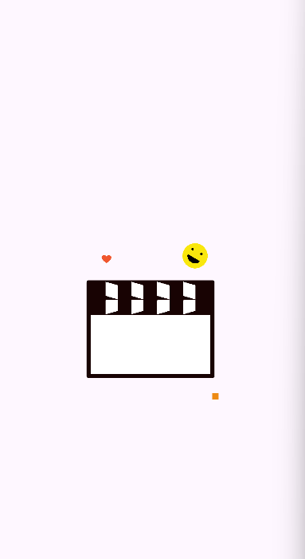

# 🎬 FrameFound - Aplicativo de Busca de Filmes

> Um aplicativo Flutter moderno e elegante para descobrir filmes e séries, desenvolvido com arquitetura limpa e as melhores práticas da indústria.

## 📋 Sobre o Projeto

O **FrameFound** é um aplicativo mobile desenvolvido em Flutter que permite aos usuários buscar informações detalhadas sobre filmes e séries. O projeto foi construído seguindo os princípios da Clean Architecture, SOLID e padrões de design modernos, garantindo código limpo, testável e facilmente mantível.

---

## 🎥 Demonstração

### Android
[](https://www.youtube.com/shorts/GVXjB34C4Fw)

### iOS
[](https://youtube.com/shorts/LqHi9pqhl6E)

> Clique na imagem para assistir a demonstração no YouTube.

---

## ✨ Funcionalidades Principais

### 🔍 **Tela de Busca de Filmes**
- **Campo de texto** personalizado com animações suaves
- **Botão de buscar** que aparece dinamicamente durante a digitação
- **Histórico de buscas** com as últimas 5 pesquisas realizadas
- **Interface responsiva** que se adapta a diferentes tamanhos de tela

### 📋 **Exibição dos Resultados**
- **Lista de filmes** com layout em cards elegantes
- **Título** e informações básicas sempre visíveis
- **Pôster** com tratamento de erro e imagem de fallback
- **Ano de lançamento** destacado visualmente
- **Clique no card** para navegar aos detalhes

### 🎭 **Tela de Detalhes do Filme**
- **Título** com header customizado e botão de voltar
- **Pôster em destaque** com carregamento otimizado
- **Informações completas**: ano, gênero, sinopse, diretor, elenco
- **Avaliação IMDb** com sistema de estrelas visual
- **Layout scrollável** para acomodar todo o conteúdo

### 📚 **Aba "Recentes"**
- **Armazenamento local** das últimas 5 buscas realizadas
- **Exibição organizada** dos filmes pesquisados
- **Acesso rápido** aos filmes já visualizados
- **Gerenciamento automático** do histórico

## 🏗️ Arquitetura e Padrões

### **Clean Architecture**
```
📁 domain/     → Regras de negócio puras (Entities, Repositories)
📁 data/       → Implementações e acesso a dados (DTOs, Services)
📁 presentation/ → Interface e lógica de apresentação (ViewModels, Widgets)
```

### **Padrões de Design Implementados**
- ✅ **Repository Pattern** - Abstração da camada de dados
- ✅ **Command Pattern** - Gerenciamento de ações assíncronas
- ✅ **State Pattern** - Controle de estados da aplicação
- ✅ **MVVM Pattern** - Separação entre lógica e apresentação
- ✅ **Observer Pattern** - Reatividade com ValueNotifier
- ✅ **Dependency Injection** - Injeção de dependências com Provider
- ✅ **Result Pattern** - Tratamento funcional de erros
- ✅ **Factory Pattern** - Criação de instâncias controlada

### **Princípios SOLID**
- **S** - Single Responsibility: Cada classe tem uma única responsabilidade
- **O** - Open/Closed: Extensível via interfaces, fechado para modificação
- **L** - Liskov Substitution: Implementações substituíveis via contratos
- **I** - Interface Segregation: Interfaces específicas e focadas
- **D** - Dependency Inversion: Dependência de abstrações, não implementações

## 🚀 Tecnologias e Ferramentas

### **Core Technologies**
- **Flutter/Dart** - Framework de desenvolvimento multiplataforma
- **BLoC/Cubit** - Gerenciamento de estado reativo
- **Provider** - Injeção de dependências e state management
- **HTTP Client com DIO** - Comunicação com APIs REST

### **Bibliotecas Principais**
- `flutter_bloc` - Gerenciamento de estado
- `provider` - Injeção de dependências
- `dio` - Cliente HTTP avançado
- `shared_preferences` - Persistência local
- `lottie` - Animações vetoriais

### **Arquitetura Modular**
```
📁 modules/
  📁 splash/    → Tela inicial com animações
  📁 home/      → Busca e listagem de filmes
  📁 details/   → Detalhes completos do filme
📁 shared/      → Recursos compartilhados
  📁 core/      → Utilitários e abstrações
  📁 http/      → Cliente HTTP personalizado
  📁 ui/        → Componentes de interface
```

## 🌐 API Integração

### **OMDb API**
- **Endpoint**: `https://www.omdbapi.com/`
- **Funcionalidades**:
  - Busca de filmes por título
  - Detalhes completos por IMDb ID
  - Suporte a filmes, séries e episódios
- **Tratamento de Erros**: Implementação robusta com fallbacks

### **Exemplo de Uso**
```dart
// Busca de filmes
GET /?apikey={key}&s={query}

// Detalhes do filme
GET /?apikey={key}&i={imdbId}&plot=full
```

## 🎨 Interface e Experiência

### **Design System**
- **Material Design 3** como base
- **Tema customizado** com cores consistentes
- **Componentes reutilizáveis** em toda aplicação
- **Animações suaves** para transições

### **Responsividade**
- **Layouts adaptativos** para diferentes telas
- **Componentes flexíveis** que se ajustam ao conteúdo
- **Tratamento de estados** de loading, erro e sucesso
- **Feedback visual** para todas as interações

## 🔧 Configuração e Execução

### **Pré-requisitos**
- Flutter SDK 3.0+
- Dart 3.0+
- Android SDK / Xcode (para build nativo)

### **Instalação**
```bash
# Clone o repositório
git clone https://github.com/seu-usuario/frame_found_app.git

# Entre no diretório
cd frame_found_app

# Instale as dependências
flutter pub get

# Execute o aplicativo
flutter run
```

### **Build para Dev**
```bash
# Android
flutter build apk --dart-define-from-file=env-dev.json --flavor dev
flutter build appbundle --dart-define-from-file=env-dev.json --flavor dev


# iOS
flutter build ios --dart-define-from-file=env-dev.json --flavor dev
```

### **Build para Produção**
```bash
# Android
flutter build apk --dart-define-from-file=env.json --flavor prod
flutter build appbundle --dart-define-from-file=env.json --flavor prod


# iOS
flutter build ios --dart-define-from-file=env.json --flavor prod
```
